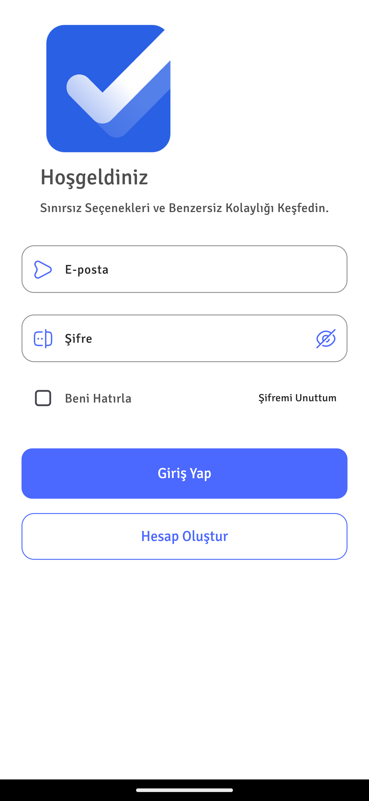
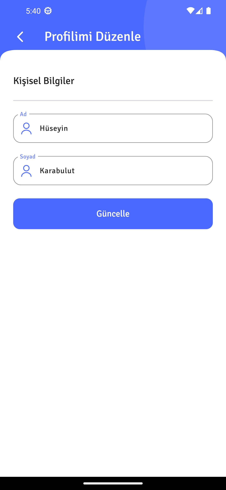

# Todo Uygulaması

Bu uygulama, Flutter ve Firebase kullanarak oluşturulmuş basit bir yapılacaklar listesi (Todo) uygulamasıdır. Kullanıcılar tamamlanmış ve tamamlanmamış görevlerini yönetebilir, yeni görevler ekleyebilir ve mevcut görevleri düzenleyebilir veya silebilir. Ayrıca kullanıcılar, profil bilgilerini görüntüleyebilir ve düzenleyebilir.

## Özellikler

- **Görev Yönetimi:** Yeni görev ekleme, mevcut görevleri düzenleme ve silme.
- **Tamamlanmış/Tamamlanmamış Görevler:** Görevlerin durumuna göre ayrı sekmelerde görüntülenmesi.
- **Kullanıcı Profili:** Kullanıcı profil bilgilerini görüntüleme ve düzenleme.
- **Onboarding Ekranı:** Uygulamanın ilk açılışında üç sayfalık tanıtım ekranı.

## Ekran Görüntüleri

<table>
  <tr>
    <td>1</td>
     <td>2</td>
     <td>3</td>  
  <tr>
    <td></td>
    <td></td>
    <td></td>   
 </table>

<table>
  <tr>
    <td>4</td>
     <td>5</td>
     <td>6</td> 
  <tr>
    <td></td>
    <td></td>
    <td></td>
 </table>
  
<table>
  <tr>
    <td>7</td>
     <td>8</td>
     <td>9</td> 
  <tr>
    <td></td>
    <td></td>
    <td></td>
 </table>

 <table>
  <tr>
    <td>10</td>
     <td>11</td>
     <td>12</td> 
  <tr>
    <td></td>
    <td></td>
    <td></td>
 </table>

 <table>
  <tr>
    <td>13</td>
     <td>14</td>
     <td>15</td> 
  <tr>
    <td></td>
    <td></td>
    <td></td>
 </table>

## Kullanım

- **Görev Ekleme:** Ekranın sol alt köşesinde bulunan `FAB` butonuna tıklayın.
- **Görev Silme/Düzenleme:** Mevcut bir görevi yana kaydırarak silebilir veya düzenleyebilirsiniz.
- **Profil Görüntüleme:** Ekranın sol üst köşesinde bulunan kullanıcı simgesine tıklayın.
- **Profil Düzenleme:** Profil sayfasında `Hesabımı Düzenle` butonuna tıklayın.
- **Hesap Silme:** Profil sayfasında `Hesabımı Sil` butonuna tıklayın.
- **Çıkış Yapma:** Profil sayfasında `Çıkış Yap` butonuna tıklayın.

## Katkıda Bulunma

Katkıda bulunmak isterseniz, lütfen bir `pull request` gönderin. Her türlü katkı memnuniyetle kabul edilir!

## İletişim

Herhangi bir sorunuz veya geri bildiriminiz varsa, lütfen e-posta ile iletişime geçin: [hsyn.kbulut@gmail.com](mailto:hsyn.kbulut@gmail.com)
